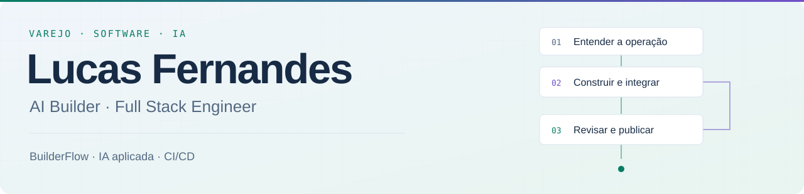

<picture>
  <source media="(prefers-color-scheme: dark) and (max-width: 600px)" srcset="./assets/header-dark-mobile.svg">
  <source media="(prefers-color-scheme: light) and (max-width: 600px)" srcset="./assets/header-light-mobile.svg">
  <source media="(prefers-color-scheme: dark)" srcset="./assets/header-dark.svg">
  <source media="(prefers-color-scheme: light)" srcset="./assets/header-light.svg">
  
</picture>

<h3 align="center">Construo software com a visão de quem também toca o negócio.</h3>

  <a href="https://www.linkedin.com/in/lucasmef">LinkedIn</a> &nbsp; / &nbsp;
  <a href="mailto:lucasmef@gmail.com">E-mail</a> &nbsp; / &nbsp;
  <a href="https://github.com/lucasmef?tab=repositories">Repositórios</a>

---

Trabalho com **varejo há mais de 15 anos**. Por isso, quando olho para um sistema, penso também em quem precisa usá-lo com a loja aberta, o cliente esperando e outras tarefas acontecendo ao mesmo tempo.

Levo essa experiência para o **desenvolvimento full stack**, da definição do produto ao deploy. Cuido de arquitetura, interfaces, backend e integrações, com agentes de IA no processo de construção e revisão.

## O que estou construindo

<table>
  <tr>
    <td width="50%" valign="top">
      E-COMMERCE
      <h3>Smart Shop</h3>
      
<strong>Uma loja de moda pensada para comprar o look.</strong>

      
Desenvolvo um e-commerce em que a cliente escolhe as peças a partir de looks. O trabalho inclui a continuidade da compra no checkout e o que sustenta cada pedido: reserva de estoque, pagamento, frete e gestão da loja.

      
<code>Next.js</code> <code>TypeScript</code> <code>Supabase</code> <code>PostgreSQL</code> <code>Vercel</code>

      
Código privado

    </td>
    <td width="50%" valign="top">
      GESTÃO FINANCEIRA
      <h3><a href="https://github.com/lucasmef/salomao">Salomão ↗</a></h3>
      
<strong>Para acompanhar o que acontece depois da venda.</strong>

      
Cobranças, conciliação, compras e fluxo de caixa, com integrações Banco Inter e Linx. Desenvolvo o sistema para reunir o trabalho do financeiro, com trilha de auditoria, segurança e publicação controlada em VPS.

      
<code>React</code> <code>FastAPI</code> <code>PostgreSQL</code> <code>Redis</code> <code>Linux</code>

    </td>
  </tr>
  <tr>
    <td width="50%" valign="top">
      PRODUTIVIDADE
      <h3><a href="https://github.com/lucasmef/doit.md">doit ↗</a></h3>
      
<strong>Para não perder a tarefa no meio das anotações.</strong>

      
Notas, tarefas, projetos e calendário num mesmo espaço. Uma PWA com Markdown, sincronização por CLI e revisão das alterações feitas por IA.

      
<code>Next.js</code> <code>React</code> <code>TypeScript</code> <code>Google APIs</code>

    </td>
    <td width="50%" valign="top">
      IA APLICADA
      <h3><a href="https://github.com/lucasmef/growth-agent">Growth Agent ↗</a></h3>
      
<strong>A IA ajuda a criar. Uma pessoa decide o que publicar.</strong>

      
Base SaaS para planejamento editorial, geração de conteúdo, aprovação e publicação. O projeto também explora experimentos controlados e análise de resultados.

      
<code>Next.js</code> <code>Prisma</code> <code>AI SDK</code> <code>Trigger.dev</code>

    </td>
  </tr>
</table>

## BuilderFlow: como organizo o trabalho

Um projeto pode passar por várias sessões e agentes. O que já foi decidido precisa continuar claro para quem assume a próxima tarefa. Aplico o **BuilderFlow** para organizar essa passagem, sem depender de reconstruir a conversa anterior.

Antes de começar, registro o problema, o escopo e os critérios de aceite. Durante a execução, mantenho as decisões e os próximos passos atualizados. Para concluir, confiro a implementação contra esses critérios, com testes e revisão.

> **Contexto → Especificação → Execução → Validação → Entrega**

  
<strong>Como preservo contexto e decisões</strong>

Uso instruções de projeto, skills, especificações e **ADRs** para registrar contexto e decisões técnicas. O **Grill Gate** entra quando há uma dúvida relevante ou um risco que o código e a documentação não resolvem.

Em mudanças de interface, incluo a conferência em desktop e mobile quando aplicável. Ajusto o rigor da validação ao risco da alteração.

## Orquestração com IA

  
  
  

Uso **Codex, Claude Code e Antigravity** para investigar código, planejar mudanças, implementar e revisar, escolhendo a ferramenta conforme a tarefa.

Orquestrar esse trabalho é decidir o que cada agente precisa saber, até onde pode mexer e como a mudança será conferida. Eu defino as prioridades, tomo as decisões de arquitetura e integro as entregas. Em mudanças críticas, mantenho uma revisão independente antes da liberação.

## CI/CD e operação

Automatizo as verificações repetitivas e separo os ambientes de validação e produção. A forma de publicar acompanha o funcionamento de cada projeto.

| Projeto | Como o código chega à produção |
| :--- | :--- |
| **Smart Shop** | Testes funcionais locais. No CI, verificações de segurança, lint, tipos e evidências. Publicação pela integração GitHub + Vercel. |
| **Salomão** | GitHub Actions e homologação em VPS. A ida para produção é manual, com verificações de saúde e rotinas operacionais. |

## Stack de trabalho

| Área | Tecnologias |
| :--- | :--- |
| **Frontend** | TypeScript · React · Next.js · Vite |
| **Backend e integrações** | Python · FastAPI · Node.js · APIs REST |
| **Dados** | PostgreSQL · Supabase · Redis · Prisma · SQLAlchemy |
| **Infraestrutura e entrega** | Vercel · GitHub Actions · Linux · Docker · Nginx |

  
<strong>Formação</strong>

**Sistemas de Informação — PUC Minas**, em andamento.  
**Tecnólogo em Marketing — Unisul**, 2022.

**AWS Academy:** Cloud Foundations, Cloud Developing e Generative AI Foundations.  
**Vercel:** Next.js App Router Fundamentals e React Foundations for Next.js.

---

  <strong>Me conte o que hoje dá trabalho na sua operação.</strong> 
  <a href="mailto:lucasmef@gmail.com">Vamos conversar</a> ·
  <a href="https://www.linkedin.com/in/lucasmef">LinkedIn</a>

