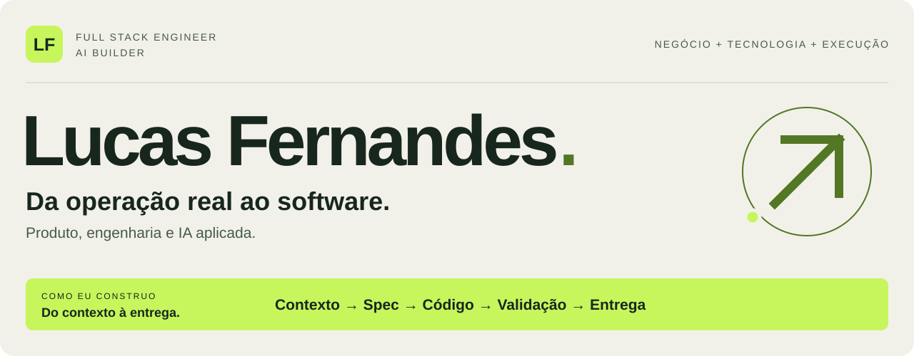
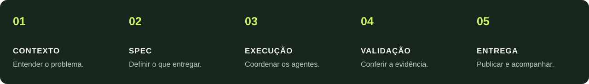

<picture>
  <source media="(prefers-color-scheme: dark) and (max-width: 600px)" srcset="./assets/header-dark-mobile.svg">
  <source media="(max-width: 600px)" srcset="./assets/header-light-mobile.svg">
  <source media="(prefers-color-scheme: dark)" srcset="./assets/header-dark.svg">
  
</picture>

  <a href="https://www.linkedin.com/in/lucasmef"><strong>Vamos conversar no LinkedIn ↗</strong></a>
  &nbsp; · &nbsp;
  <a href="mailto:lucasmef@gmail.com">E-mail</a>
  &nbsp; · &nbsp;
  <a href="#projetos">Projetos</a>
  &nbsp; · &nbsp;
  <a href="#ia-e-specs">IA &amp; specs</a>

### Entendo o problema de negócio. Construo o software para resolvê-lo.

São **mais de 15 anos no varejo**, lidando com clientes, estoque e financeiro. Hoje, levo essa experiência para o desenvolvimento full stack: conecto a necessidade de quem usa o produto às decisões de interface, arquitetura, dados e operação.

**Trabalho da especificação ao deploy, com agentes de IA no processo e responsabilidade técnica sobre a entrega.**

<table>
  <tr>
    <td width="33%" valign="top"><strong>01 / Visão de produto</strong> Traduzir a rotina do negócio em requisitos e fluxos de uso.</td>
    <td width="33%" valign="top"><strong>02 / Engenharia full stack</strong> Conectar interface, backend, dados, integrações e operação.</td>
    <td width="33%" valign="top"><strong>03 / IA com método</strong> Coordenar agentes com contexto, specs e critérios de aceite.</td>
  </tr>
</table>

## 01 / Projetos que mostram como eu trabalho

### Loja de Jogos Usados

**Do cadastro do cliente à venda, com o estoque acompanhando cada operação.**

Projeto acadêmico em equipe. Minha frente reúne **clientes e vendas**: cadastro, consulta, histórico, registro da forma de pagamento, baixa de estoque e eventos de auditoria. A implementação trata confirmação duplicada, falhas de gravação e preservação do histórico.

Também organizo o trabalho com **specs, contratos entre módulos, tarefas rastreáveis e revisão independente**, para que as entregas possam ser integradas pela equipe.

`JavaScript` `HTML & CSS` `ES Modules` `localStorage` `Testes com Node.js`

<strong>Estado:</strong> frente de clientes e vendas concluída e revisada; integração geral em andamento. Repositório privado. Demo pública em breve.
<!-- Quando a demo estiver publicada, substituir o aviso acima pelo link público confirmado do GitSites. -->

---

### Smart Shop

**Comprar o look. Sustentar cada pedido.**

Desenvolvo um e-commerce de moda com compra por looks, conectando a experiência da vitrine ao checkout às integrações de estoque, pagamento, frete e gestão da loja.

`Next.js` `TypeScript` `Supabase` `PostgreSQL` `Vercel`

Em desenvolvimento · Código privado

---

### [Salomão ↗](https://github.com/lucasmef/salomao)

**O financeiro também precisa de engenharia.**

Sistema de cobranças, conciliação, compras e fluxo de caixa, com integrações Banco Inter e Linx. O trabalho combina integração bancária, MFA, auditoria, cache no backend e deploy controlado em VPS, com verificações de saúde após a publicação.

`React` `FastAPI` `PostgreSQL` `Redis` `Linux`

[Explorar as decisões de segurança ↗](https://github.com/lucasmef/salomao#segurança-em-destaque)

---

### [doit.md ↗](https://github.com/lucasmef/doit.md)

**A IA edita. A pessoa revisa o que muda.**

PWA de notas, tarefas e calendário com sincronização por CLI. Alterações no workspace Markdown passam por auditoria antes de entrar no app, com histórico e restauração. Integra Google Calendar e Drive.

`Next.js` `TypeScript` `Node.js` `Google APIs`

[Ver o fluxo de auditoria ↗](https://github.com/lucasmef/doit.md#auditoria-e-ia)

---

### [Growth Agent ↗](https://github.com/lucasmef/growth-agent)

**Da estratégia editorial ao conteúdo aprovado.**

Base SaaS com geração de conteúdo, aprovação humana, agendamento e analytics. Separa a operação de clientes dos experimentos internos com agentes, com jobs assíncronos e integrações de publicação.

`Next.js` `Prisma` `AI SDK` `Trigger.dev`

[Explorar os fluxos do produto ↗](https://github.com/lucasmef/growth-agent#principais-funcionalidades)

## 02 / IA e specs: como conduzo a entrega

**Usar IA no desenvolvimento exige saber definir, dividir, revisar e integrar o trabalho.** Uso Codex, Claude Code e Antigravity para investigar código, planejar, implementar e revisar. Defino as prioridades e a arquitetura, preservo o contexto entre sessões e confiro o resultado contra o que foi especificado.

| Capacidade | Como aplico |
| :--- | :--- |
| **Desenvolvimento orientado por specs** | Transformo o problema em escopo, contratos, critérios de aceite e tarefas verificáveis. Atualizo a especificação conforme o projeto evolui. |
| **Orquestração de agentes** | Delimito responsabilidades, arquivos e dependências. Coordeno execução e revisão independente, integrando as entregas. |
| **Engenharia de contexto** | Organizo instruções em `AGENTS.md`, skills reutilizáveis e registros de decisões para dar continuidade ao trabalho entre sessões. |
| **IA dentro do produto** | Estruturo geração de conteúdo, jobs e fluxos de aprovação, como no Growth Agent, e auditoria de mudanças, como no doit.md. |
| **Validação e operação** | Verifico regras de negócio, cenários de falha e interfaces em desktop e mobile. Uso testes, CI/CD e verificações de saúde conforme o risco da mudança. |

### BuilderFlow / O método também virou projeto

Criei o **[BuilderFlow ↗](https://github.com/lucasmef/builder-flow)** para organizar desenvolvimento com IA: uma spec viva por funcionalidade, contexto persistente, decisões de arquitetura e evidências de validação no repositório.

<picture>
  <source media="(max-width: 600px)" srcset="./assets/workflow-mobile.svg">
  
</picture>

  
<strong>O que fica registrado além do código</strong>

- **Contexto e decisões:** problema, restrições e ADRs para escolhas de arquitetura.
- **Especificação e execução:** escopo, critérios de aceite, tarefas e dependências.
- **Evidências:** testes, revisão e conferência visual quando a interface muda.
- **Continuidade:** estado da entrega, pendências e próximos passos para a próxima sessão ou pessoa.

## 03 / Stack para construir e operar

| Camada | Tecnologias |
| :--- | :--- |
| **Interfaces** | TypeScript · JavaScript · React · Next.js · HTML · CSS · Vite |
| **Backend & integrações** | Python · FastAPI · Node.js · APIs REST |
| **Dados** | PostgreSQL · Supabase · Redis · Prisma · SQLAlchemy |
| **IA & automação** | Codex · Claude Code · Antigravity · AI SDK · Trigger.dev |
| **Entrega & infraestrutura** | GitHub Actions · Vercel · Linux · Docker · Nginx |

  
<strong>Formação e estudos</strong>

**Sistemas de Informação · PUC Minas**, em andamento. 
**Tecnólogo em Marketing · Unisul**, 2022.

**AWS Academy:** Cloud Foundations, Cloud Developing e Generative AI Foundations. 
**Vercel:** Next.js App Router Fundamentals e React Foundations for Next.js.

---

### Seu time precisa conectar produto, engenharia e IA?

Quero conversar sobre desafios de **desenvolvimento full stack e IA aplicada**, especialmente onde entender a operação faz diferença nas decisões técnicas.

**[Vamos conversar no LinkedIn ↗](https://www.linkedin.com/in/lucasmef)** &nbsp; · &nbsp; [Fale comigo por e-mail](mailto:lucasmef@gmail.com)

Lucas Fernandes · Visão de negócio. Clareza para especificar. Engenharia para entregar.
